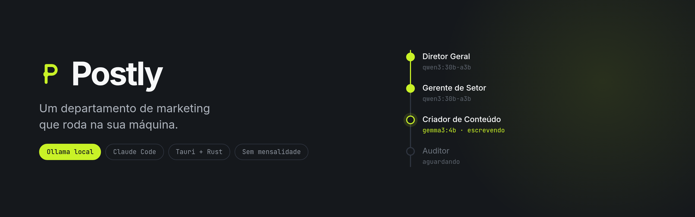
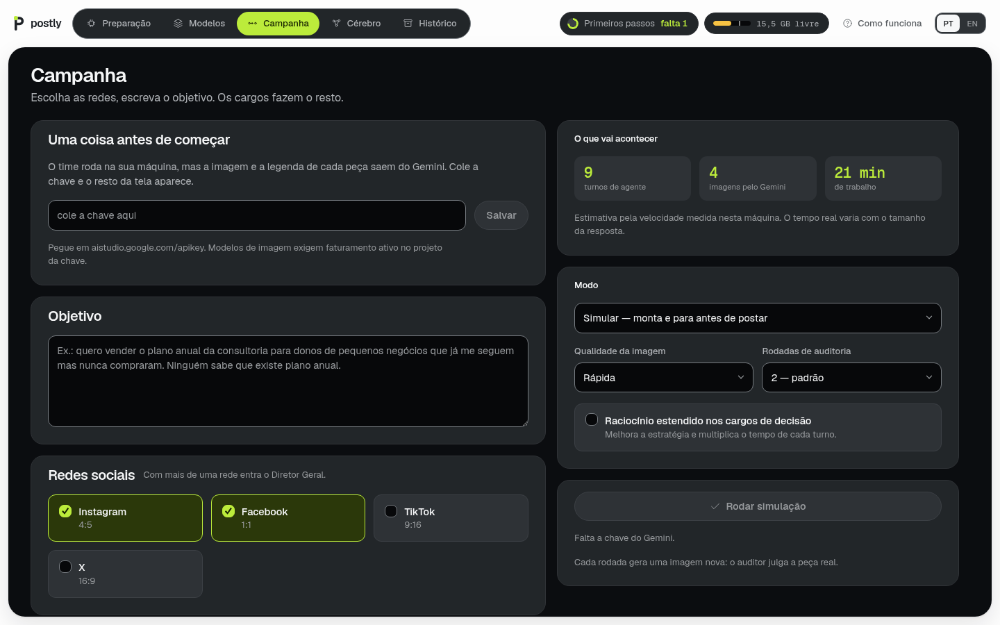
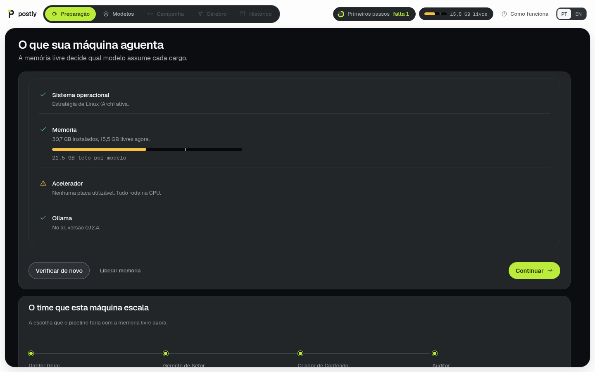
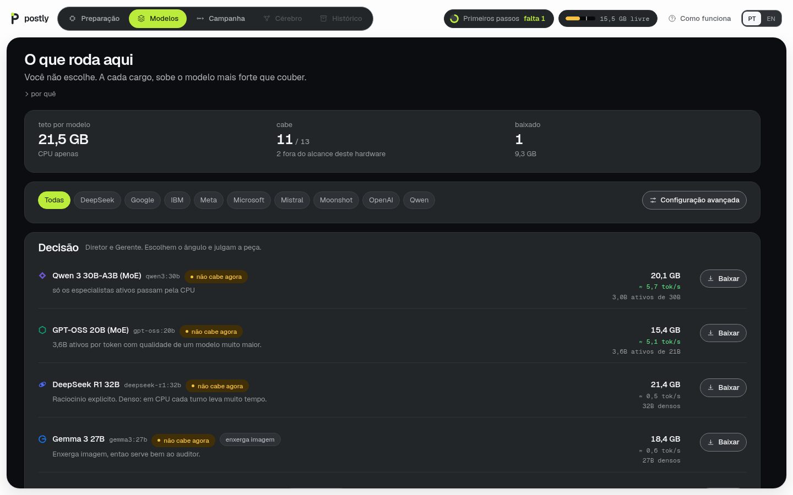
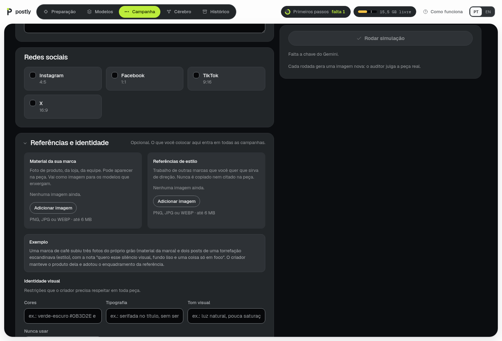
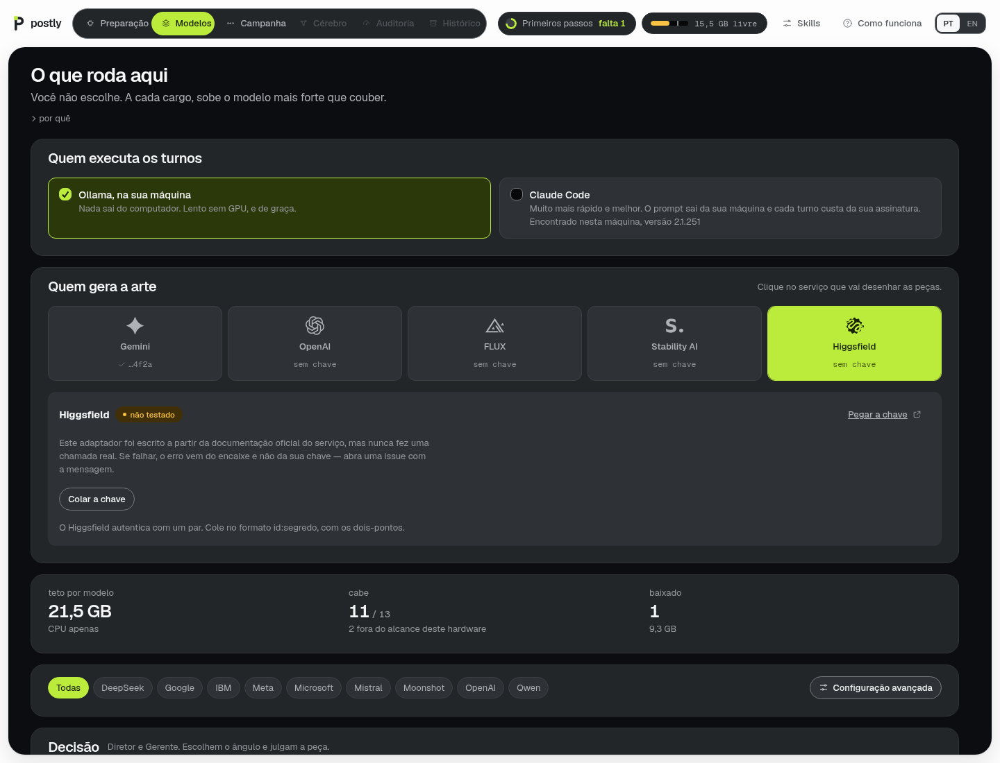
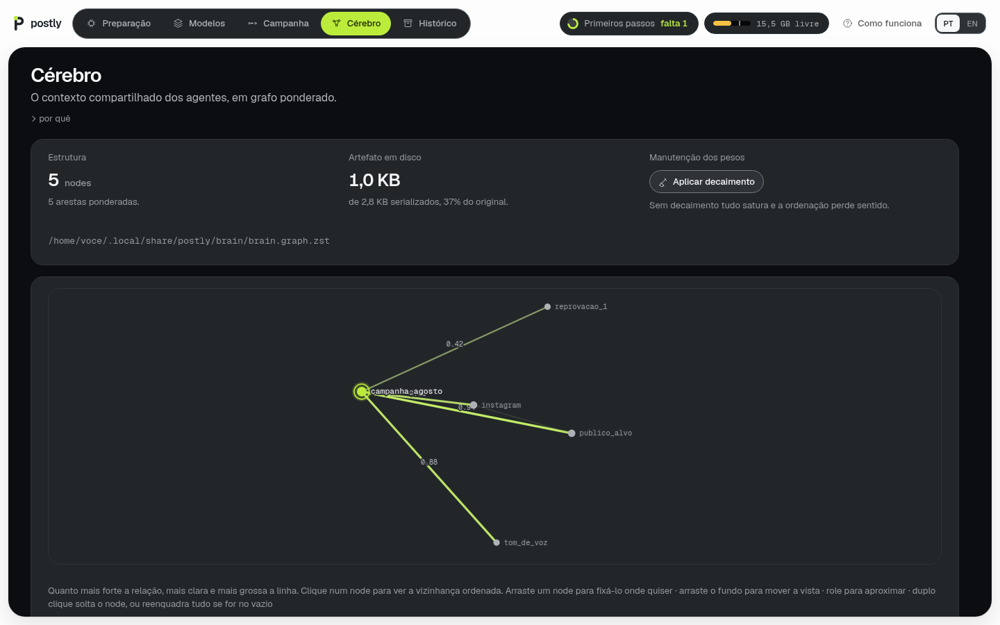
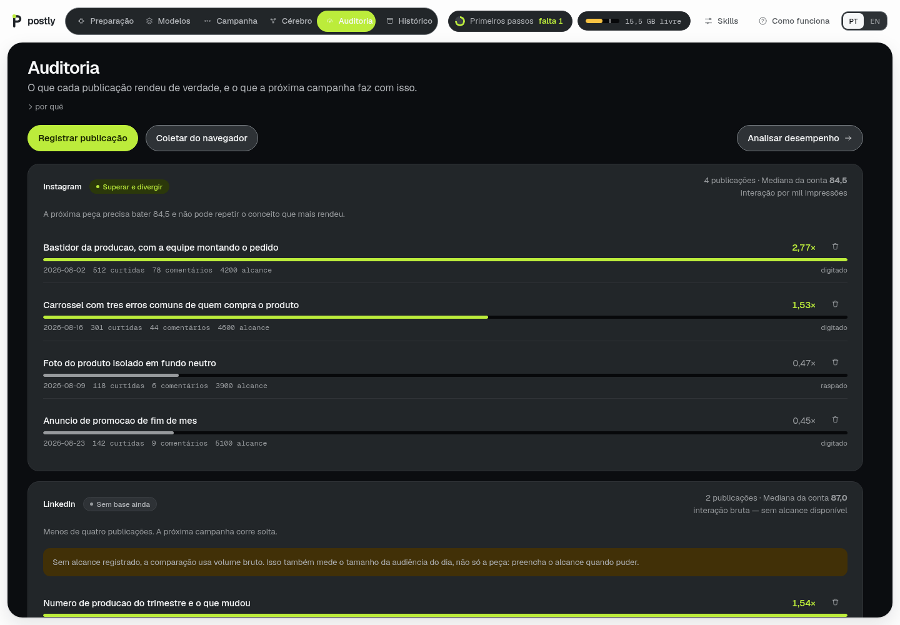
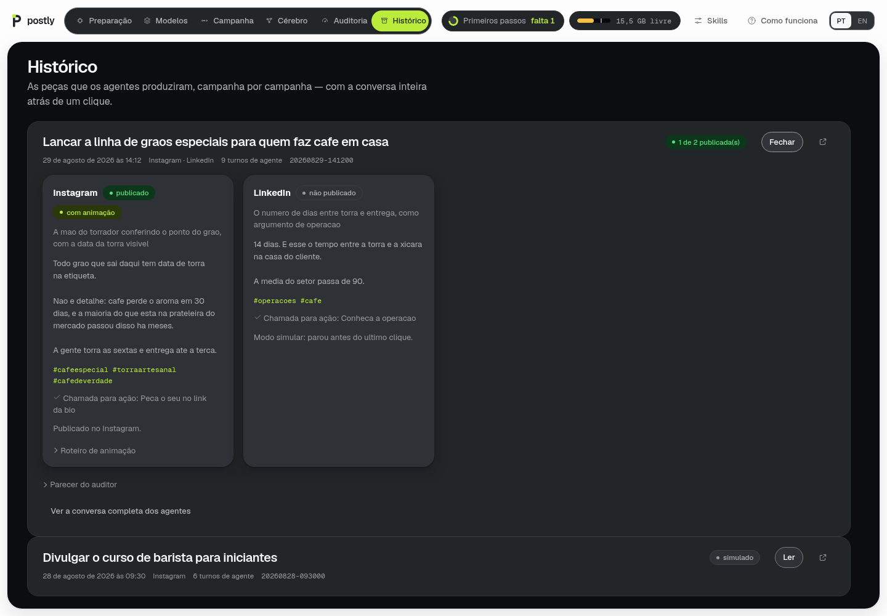

<div align="center">



# Postly

**Um departamento de marketing que roda na sua máquina.**

[](LICENSE)
[](#instalação)
[](https://tauri.app)
[](https://ollama.com)

[Instalação](#instalação) ·
[Primeiro uso](#primeiro-uso-passo-a-passo) ·
[Como funciona](#como-funciona) ·
[Privacidade](#privacidade-e-o-cofre) ·
[Contribuindo](#contribuindo)

</div>

---

Você escreve o que quer atingir. Quatro cargos de IA se revezam em modelos
locais do Ollama para chegar lá: um decide a linha, um cria a peça, um audita,
e a decisão de publicar é conjunta. Nada sai do seu computador além das
chamadas ao Gemini que geram a imagem e do navegador que publica nas suas
próprias contas.



### De relance

| | |
|---|---|
| **Roda onde** | Sua máquina. Windows, macOS e Linux. |
| **Quem desenha** | Gemini, OpenAI, FLUX, Stability AI ou Higgsfield — você escolhe. |
| **Quem escreve** | Modelos locais do Ollama (37 no catálogo) ou o seu Claude Code. |
| **Quem decide** | Quatro cargos com níveis diferentes, um modelo residente por vez. |
| **O que sai para fora** | Só a chamada ao Gemini que gera a imagem, e o navegador que publica nas suas contas. |
| **Memória** | Grafo ponderado em disco, sem banco de dados. |
| **Aprende com o resultado** | Sim: o desempenho medido entra no prompt da campanha seguinte. |
| **Custo fixo** | Zero. O único custo variável é a geração de imagem. |

### Por que isto existe

Ferramentas de marketing com IA cobram por mês, guardam suas campanhas num
servidor alheio e escondem qual modelo escreveu o quê. O Postly faz o oposto:
os modelos rodam no seu hardware, cada conversa fica em Markdown num arquivo
seu, e o único custo variável é a geração de imagem.

A parte difícil não é chamar um modelo — é fazer quatro caberem numa máquina
comum. É disso que trata o [middleware](#um-modelo-por-vez).

---

## Instalação

Um comando. Ele detecta o seu sistema, confirma com você e instala:

```bash
curl -fsSL https://raw.githubusercontent.com/JTeixeiraz/Postly/main/scripts/instalar.sh | bash
```

O instalador pergunta qual é o seu sistema (setas do teclado e Enter), baixa o
pacote da release mais recente e coloca no lugar certo. Se não houver pacote
pronto para a sua combinação de sistema e arquitetura, ele compila do
código-fonte.

<details>
<summary><b>Instalar à mão</b></summary>
<br>

Baixe o pacote do seu sistema em [Releases](https://github.com/JTeixeiraz/Postly/releases):

| Sistema | Arquivo | Como instalar |
|---|---|---|
| Linux (qualquer distro) | `.AppImage` | `chmod +x` e execute |
| Linux (Debian, Ubuntu) | `.deb` | `sudo dpkg -i postly_*.deb` |
| Linux (Fedora, RHEL) | `.rpm` | `sudo rpm -i postly-*.rpm` |
| macOS | `.dmg` | arraste para Aplicativos |
| Windows | `.msi` | duplo clique |

No macOS, a primeira abertura pede confirmação: clique com o botão direito no
app e escolha **Abrir**.

</details>

<details>
<summary><b>Compilar do código-fonte</b></summary>
<br>

Precisa de [Rust](https://rustup.rs), Node 18+ e as
[dependências do Tauri](https://tauri.app/start/prerequisites/) para o seu
sistema.

```bash
git clone https://github.com/JTeixeiraz/Postly.git
cd postly
npm install
npm install --prefix sidecar    # baixa o Playwright e o Chromium
npm run tauri dev               # rodar em desenvolvimento
npm run tauri build             # gerar os pacotes
```

</details>

### Requisitos

| | |
|---|---|
| **Ollama** | Você não precisa instalar. O app faz isso na primeira abertura, com barra de progresso, usando pacman, winget, Homebrew ou o script oficial conforme o sistema. |
| **Chave do Gemini** | Gera a imagem e a legenda de cada peça. Pegue em [aistudio.google.com/apikey](https://aistudio.google.com/apikey). |
| **Memória** | 16 GB para um uso confortável. Roda em 8 GB com modelos menores. |
| **GPU** | Opcional. Sem ela o sistema escolhe modelos MoE, que são muito mais rápidos na CPU. |

> [!IMPORTANT]
> Os modelos de imagem do Gemini exigem **faturamento ativo** no projeto da
> chave — a cota do nível gratuito para eles é zero. Assinar o Google AI Studio
> Pro **não** habilita a API: são produtos separados. A geração de texto
> funciona no nível gratuito normalmente.

---

## Primeiro uso, passo a passo

### 1. Abra o app

Ele mede a sua máquina antes de pedir qualquer coisa: sistema operacional,
memória livre, acelerador e Ollama. Se o Ollama não estiver instalado, um botão
resolve.



O guia no topo mostra quanto falta até a primeira campanha, e some quando você
termina.

### 2. Escolha (ou não) os modelos

Por padrão o sistema decide sozinho qual modelo assume cada cargo, remedindo a
memória a cada troca. Aqui você baixa modelos do catálogo, e a **Configuração
avançada** fixa o modelo de cada cargo se preferir mandar.



São **37 modelos em nove famílias** — Qwen, OpenAI, Meta, Google, Mistral,
DeepSeek, Microsoft, IBM e Moonshot. Todas as tags existem na biblioteca
pública do Ollama, então o botão baixar funciona de verdade.

### 3. Cole a chave e descreva o objetivo

Escreva em uma frase o que você quer, do jeito que explicaria para uma pessoa.
Escolha as redes. O painel da direita mostra **o que vai acontecer**: quantos
turnos, quantas imagens e quanto tempo, estimado pela velocidade medida na sua
máquina.

### 4. Opcional: dê referências



Duas coisas diferentes, e a distinção importa:

- **Material da sua marca** — foto de produto, da loja, da equipe. Vai como
  imagem para os modelos que enxergam e pode aparecer na peça.
- **Referências de estilo** — trabalho de outras marcas que serve de direção.
  Vai só como texto, porque entregar a arte de outra marca para um modelo
  copiar é o caminho mais curto para sair logotipo alheio na sua peça.

A **identidade visual** (cores, tipografia, tom, e o que nunca usar) entra em
toda peça como restrição.

### 5. Rode

O padrão é **Simular**: o navegador abre, faz login, monta a publicação inteira
e para antes do último clique. É assim que você confere antes de publicar de
verdade.

A trilha no topo mostra onde o despacho está. Cada turno leva minutos numa
máquina sem GPU, então dá para sair e voltar.

---

## Como funciona

### Um modelo por vez

Um agente de marketing que funcione precisa de raciocínio para decidir e de
obediência para executar, e esses são modelos diferentes. Rodar todos ao mesmo
tempo numa máquina comum não cabe. Então o sistema não é um chat com
ferramentas, é um **middleware**:

```
Diretor Geral ──▶ Gerente de Setor ──▶ Criador ──▶ Auditor ──▶ decisão conjunta
   (alto)         (alto, um por rede)   (baixo)     (médio)         │
                                             ▲                      │
                                             └── reprovado ─────────┘
```

A cada troca de cargo ele mede a memória livre, escolhe o modelo mais forte que
couber naquele nível, sobe, recebe a resposta, grava a conversa inteira em
Markdown, **descarrega o modelo** e passa adiante só a mensagem que atravessa.
Nunca há dois modelos residentes.

O nível do modelo é proporcional ao que o cargo entrega. Quem decide precisa
raciocinar; quem cumpre um briefing pronto, não.

### Quem executa: Ollama ou o seu Claude Code

Por padrão os turnos rodam em modelos locais do Ollama. Se você já tem o
**Claude Code** instalado, pode trocar o executor na aba Modelos e ganhar
velocidade: o mesmo princípio vale, só que o eixo muda — decisão vai para Opus,
auditoria para Sonnet, execução para Haiku.

Isso executa o binário `claude` da sua máquina, com a sessão que você já logou.
**Não existe campo de chave de API em lugar nenhum do Postly.** O CLI prefere
`ANTHROPIC_API_KEY` quando ela está no ambiente, e um processo filho herda o
ambiente do pai — então o Postly remove essa variável (e as de Bedrock e Vertex)
do processo do Claude Code. O turno roda pela sua assinatura, ou não roda. O
custo de cada turno aparece na trilha.

### Quem desenha a arte: você escolhe



O texto sai dos modelos locais; a arte precisa de um serviço de imagem. Cinco
estão integrados, e a escolha é clicando na logo:

| | Modelo | Autenticação | Estado |
|---|---|---|---|
| **Gemini** | `gemini-3-pro-image` / flash | chave | **testado contra a API real** |
| **OpenAI** | `gpt-image-1` / mini | chave | escrito pela documentação |
| **FLUX** | `flux-2-pro` / klein 9B | chave | escrito pela documentação |
| **Stability AI** | Stable Image ultra / core | chave | escrito pela documentação |
| **Higgsfield** | Soul v2 | par `id:segredo` | escrito pela documentação |

Cada serviço tem sua própria chave no cofre, então trocar de gerador não apaga
a configuração do anterior.

> [!NOTE]
> Só o Gemini fez uma chamada real durante o desenvolvimento. Os outros quatro
> foram escritos a partir da documentação oficial de cada um e a tela diz isso
> em cada cartão. Se um falhar, o erro provavelmente está no encaixe e não na
> sua chave — a mensagem do erro numa issue ajuda a corrigir.

### O catálogo se adapta ao hardware

| Máquina | Escolha para os cargos de decisão | Por quê |
|---|---|---|
| GPU dedicada | o denso mais capaz que couber na VRAM | a multiplicação acontece na placa |
| Apple Silicon | mesmo teto da RAM, acelerado | memória unificada, sem cópia |
| Só CPU | MoE com poucos parâmetros ativos | só os especialistas ativos passam pela CPU |

Essa última linha inverte a intuição: num PC sem GPU, `qwen3:30b` (3B ativos,
19 GB) gera **mais rápido** que `qwen3:14b` (14B ativos, 9,3 GB), apesar de
ocupar o dobro de memória. Otimizar por tamanho de arquivo leva à escolha
errada, e é por isso que o catálogo ranqueia por vazão estimada e não por
tamanho.

### O cérebro



Contexto compartilhado em grafo ponderado, sem banco de dados. Cada aresta
carrega um peso de 0 a 1; consultar um node devolve a vizinhança **já ordenada**
e cortada por limiar e top-k, então o corte acontece na consulta e não dentro do
modelo. Em profundidade maior que 1, o peso efetivo de um caminho é o produto
dos pesos percorridos, o que faz a expansão morrer sozinha.

Os pesos são mutáveis: reforçam quando a relação é confirmada, decaem sem uso, e
uma única execução não pode deslocar um peso mais que 0,05. Sem esse teto, uma
campanha reordenaria o grafo inteiro; sem o decaimento, tudo satura e a
ordenação perde o sentido.

Em disco o grafo vive serializado em bincode e compactado com zstd. Nenhuma rota
escreve o grafo em texto puro.

Na tela você arrasta os nodes, aproxima com a roda e clica para ver a vizinhança
ordenada — que é exatamente o que um agente recebe ao consultar.

### A auditoria fecha o laço



Um gerador de conteúdo sem retorno de desempenho repete o que o modelo acha
bonito, não o que funcionou. Você registra o desempenho de cada publicação (a
mão, ou lendo curtidas e comentários pelo navegador) e o sistema ranqueia cada
peça contra a mediana da própria conta.

A regra é **sempre melhorar, nunca repetir**: o que rendeu vira piso a superar,
e o prompt do cargo que decide a próxima campanha recebe o número exato a bater
junto da ordem de não repetir o conceito vencedor. A única exceção é o acerto
extraordinário — uma peça que bate **três vezes** a mediana deixou de ser sorte,
e aí vale seguir na mesma linha enquanto render.

Alcance costuma morar no painel profissional da rede e a raspagem não chega lá.
Quando não há alcance, o ranking cai para interação bruta e a tela avisa: volume
também mede o tamanho da audiência do dia, não só a peça.

### Tudo fica gravado



Cada campanha vira uma pasta com a **conversa inteira** de cada cargo em
Markdown — system prompt, entrada, resposta completa, raciocínio e a mensagem
que atravessou — mais as artes geradas e um `pecas.json` com o resultado:
legenda final, hashtags, chamada para ação, se publicou ou simulou, e o roteiro
de animação quando houver.

O Histórico mostra as peças; a transcrição fica um clique atrás, para quando
você quiser auditar **como** o sistema chegou naquilo. Nada disso depende do
app estar aberto: são arquivos seus, numa pasta que você pode versionar, copiar
ou apagar.

### Motion Designer, quando a peça pede

Um quinto cargo, opcional. O gerente declara no fim do briefing se a ideia
depende de movimento para funcionar — uma transformação antes-depois, um número
que precisa subir. Quando declara, a campanha **para** e pergunta, com uma
notificação nativa do sistema junto: um turno leva minutos e um modal atrás de
outra janela é o mesmo que não ter perguntado.

Se você aceitar, o Motion Designer devolve um roteiro de animação — cenas com
tempo, o que se move e como, o último quadro do laço. Ele não gera o vídeo: a
entrega é o roteiro, e ele não toca na peça, que já foi aprovada.

### A doutrina de marketing

Os quatro cargos não improvisam. Cada um recebe frameworks nomeados por canal
(PAS para anúncio, Hook-Story-Offer para social orgânico, AIDA e BAB para
conversão), as restrições reais de cada rede (os 280 caracteres do X, o corte em
210 do LinkedIn, as duas primeiras linhas do Instagram) e uma lista de
proibições: dado inventado, urgência falsa, garantia de resultado e a família
"solução completa / transforme seu negócio".

O auditor recebe a mesma doutrina como critério — adjetivo no lugar de número
reprova tanto quanto erro de fato.

### Skills

A doutrina acima é compilada em todo cargo que produz e não pode ser desligada.
Além dela, você pode acrescentar instruções próprias por cargo na aba **Skills**
(ao lado do guia, no topo). Elas entram no fim do system prompt, depois da
doutrina e do organograma, e nascem desligadas — é a alavanca que mais
facilmente estraga o resultado, e o estrago é silencioso.

---

## Privacidade e o cofre

O que sai da sua máquina: as chamadas ao Gemini (o prompt da imagem e o texto da
legenda) e o tráfego do navegador para as redes onde você publica. **Mais nada.**
Não há telemetria, não há servidor do projeto, não há conta para criar.

Sobre o cofre, e vale ser específico porque isso costuma ser vendido com mais
confiança do que merece:

O **código** do cofre está no repositório, em
[`src-tauri/src/vault.rs`](src-tauri/src/vault.rs) — ele precisa estar, tanto
para o app compilar quanto para você auditar o que ele faz. O que nunca entra no
repositório são os **dados**: `vault.bin`, `vault.key` e tudo o mais que o app
grava vivem em `~/.local/share/postly` (ou o equivalente do seu sistema), e o
`.gitignore` recusa esses nomes como rede de segurança.

> [!WARNING]
> **O cofre não é um cofre de verdade.** AES-256-GCM protege contra backup,
> sincronização de nuvem e alguém lendo o disco. Não protege contra um programa
> rodando com o seu usuário. Por isso o padrão é não guardar senha: a sessão do
> navegador fica no perfil local e o login acontece uma vez só.

---

## Limites conhecidos

Estes são problemas reais, não pendências que serão resolvidas na próxima
versão. Saber deles antes evita frustração.

**Velocidade sem GPU.** Medido em CPU (Ryzen 5000, sem ROCm): ~1,2 tok/s num
denso de 14B. Um gerente com resposta longa leva dezenas de minutos. Isso é a
física da máquina, não do código. Prefira MoE, ou uma GPU.

**Os seletores das redes sociais quebram.** Instagram, TikTok e companhia mudam
markup toda semana e resistem ativamente a automação. Os adaptadores tentam
vários seletores em ordem e tiram captura de tela quando falham, mas conte com
manutenção. **Use o modo Simular primeiro.**

**O TikTok espera vídeo.** O sistema gera imagem. Para o TikTok funcionar de
verdade seria preciso geração de vídeo, que ainda não existe aqui.

**Cada rodada de auditoria custa uma imagem.** O auditor julga a peça real, não
a promessa dela, então reprovar significa gerar de novo pelo Gemini.

---

## Estrutura do projeto

```
src/                      frontend em React + TypeScript
├── screens/              uma tela por arquivo
├── components/           peças reutilizáveis
└── i18n/                 dicionário PT e EN

src-tauri/src/            backend em Rust
├── orchestrator/         o pipeline: cargos, prompts, transcrição
├── ollama/               catálogo, cliente, instalador
├── brain/                o grafo ponderado e a persistência
├── platform/             estratégia por sistema operacional
├── browser/              ponte com o sidecar do Playwright
├── imagem/               os cinco geradores de arte, um adaptador cada
├── gemini/               cliente da API de imagem e texto
├── metricas.rs           desempenho publicado e a regra de divergir
└── vault.rs              cofre cifrado

sidecar/                  Node + Playwright, um processo por demanda
└── networks.mjs          um adaptador por rede social
```

### Desenvolvimento

```bash
npm run tauri dev                  # app em modo desenvolvimento
npm run build                      # checagem de tipos + build do frontend
cd src-tauri && cargo test         # 38 testes
./scripts/primeira-vez.sh          # apaga o estado, para testar o onboarding
```

**Stack:** [Tauri v2](https://tauri.app) (Rust + WebView), React, TypeScript,
[Playwright](https://playwright.dev) num sidecar Node,
[Ollama](https://ollama.com) para os modelos locais e a API do Gemini para
imagem e legenda.

Por que Tauri e não Electron: idle de ~45 MB contra ~180 MB, instalador de 8 MB
contra 165 MB. Numa máquina onde um modelo ocupa 20 GB, isso decide. E o
Electron traria um segundo Chromium além do que o Playwright já sobe.

---

## Contribuindo

Contribuições são bem-vindas. Alguns lugares onde ajuda faz diferença imediata:

- **Adaptadores de rede social** (`sidecar/networks.mjs`) — é o código que mais
  quebra, e quem usa uma rede específica é quem percebe primeiro.
- **Modelos no catálogo** (`src-tauri/src/ollama/catalog.rs`) — se você roda um
  modelo que funciona bem num cargo, ele provavelmente merece entrar.
- **Traduções** — o dicionário está em `src/i18n/`, com PT e EN em paridade
  garantida por tipo.
- **Geração de vídeo** para o TikTok funcionar de verdade.

Antes de abrir um PR:

```bash
npm run build && (cd src-tauri && cargo test)
```

Convenções do projeto: arquivos abaixo de 500 linhas, comentário explica *por
que* e não *o que*, e nenhuma dependência nova sem um motivo que caiba numa
frase.

Encontrou um problema? [Abra uma issue](https://github.com/JTeixeiraz/Postly/issues)
com o seu sistema, o que você esperava e o que aconteceu. Se for falha de
publicação, a captura de tela que o app salva em `browser/_screenshots` ajuda
muito.

---

## Licença

[MIT](LICENSE). Use, modifique e distribua à vontade.

<div align="center">
<br>
<sub>Os modelos rodam na sua máquina. As campanhas são suas.</sub>
</div>
